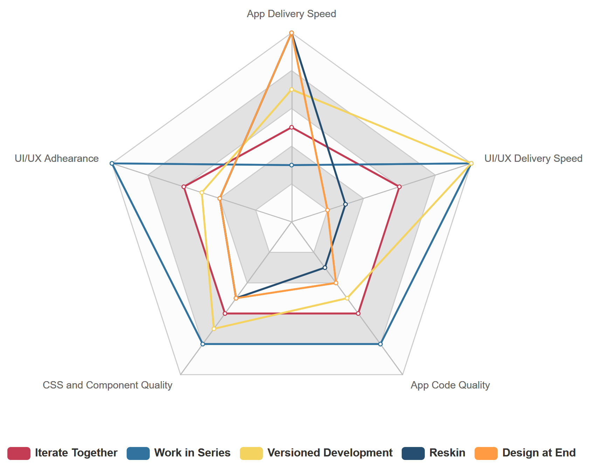

*Managing cost and risk of a custom design system*

> *I wrote this in September 2020 while at Oasis Digital. Tooling has moved — Figma has largely replaced Sketch, Zeplin has been acquired and repositioned, and design tokens are now a mature, near-standardized thing. But the trade-off framework in the middle of this piece is what I still reach for when a team is trying to figure out how to ship a custom design system alongside the app that consumes it. — Paul, 2026*

---

## Introduction

At Oasis Digital we are brought into projects at varying stages of the development lifecycle. As a result, we are able to observe the effects on the budget and timeline of a project based on decisions made prior to our arrival. We've frequently found that the following decisions can have outsized impacts on both budget and timeline relative to how they are perceived by our clients:

- whether to use an off-the-shelf design system
- design of the application UI/UX
- whether to create a component library
- how these pieces fit together

Some clients have already implemented their design system and integrated it in their applications. Many are already behind on time and budget. Others never succeed. One outcome remains the same: **it always takes longer and costs more than anticipated to build and integrate a custom design system.**

## Why are custom design systems expensive?

One of our clients — let's call them "Acme" — has been working with a design firm to establish a process for iterating on design and implementation of a custom design system. As part of this effort, Acme approached Oasis Digital to advise on connecting the deliverables of the design firm to the development process of Acme. This article describes the goals, challenges, and potential processes for shipping the various layers of a design system and its integration into an application. It also describes the risks associated with those processes, to aid decision-makers in choosing among them.

The primary driver is the desire to iterate on the visual design system and automatically capture changes for use in any downstream development effort. More specifically, this process should consist of or allow:

- Developing:
  - a design system
  - framework-agnostic component SCSS
  - an Angular component library that consumes the agnostic component classes
  - an application that consumes the component library
- Developing all layers concurrently
- Utilizing different teams to develop each of the layers
- Managing the collaboration in source control
- Delivering the first application as soon as possible
- Maintaining a high degree of code quality in all layers

With these goals in mind, the desired process should start with an export of the design components directly from the designer tools into a form suitable for check-in to source control. This could be basic CSS or any other format suitable for viewing in a text format. This output should also be suitable for use in understanding what visual aspects of the components have changed. Ideally — but secondary to these goals — the output would be a form of CSS that could be directly consumed as part of a larger library.

## Key challenges

Design and prototyping tools generate artifacts that are either too specific or too generic for use as the desired base deliverable. Adobe XD, Sketch, and Figma all have ideas of both design tokens and components. Design tokens are used to represent atomic pieces of a design system such as color, typography, and spacing. Components, in the context of design tools, are named arrangements of visual elements. While similar to the idea of components from the domain of web development, design tools do not attempt to attach an HTML structure to the visual representation. As a result, it is not currently possible to create an export of a visual component in a form that is suitable to check into source control.

Instead, it is possible to ask for the base design tokens (color, fonts, spacing) as CSS. Such an output is usable as the base of a CSS framework, but fails to capture the intricacies of the more complex components. This requires a developer to manually diff and copy the design implementations from the design tool into a CSS implementation without a concise way of knowing what has changed.

It is also possible, with the use of plug-ins, to associate a visual component with a framework component. This doesn't produce any code; rather, it makes it easier to reference a particular implementation that is independently maintained.

This has led us to the questions: *"Why do design tools not support this use case?"* and *"What process should be used to close this semantic gap?"*

## Common patterns

**The challenge faced by Acme is common among many companies attempting to integrate a new design system. However, the specific constraints presented here form a platonic ideal that causes the semantic gap of design system integration to crystallize as a definable problem.** The list of goals stated above are justifiably desired. However, this example is relatively extreme in that all of the work is beginning around the same time; the design work doesn't have a very big "head start." The integration between design work, component implementation, and application implementation particularly exacerbates the usual semantic gap. To understand how the combination of Acme's goals forms this platonic ideal, let's examine scenarios previously encountered by Oasis Digital.

### Generic CSS implementations

While many companies maintain a framework-specific version of a design system, it is becoming less common to find a canonical, generic CSS implementation. When these do exist they typically take the form of a BEM implementation that is not suitable for use in a component-based web framework. This usually results in two collections of stylesheets being maintained: the "canonical source" and the framework-specific implementation.

### Timing and existing design systems

Regarding timing, many companies will have already shipped a company-wide visual design before application development has started. A subset of these teams will also have implemented at least one visual component library (sometimes more than one) that is compatible with the application platform. Having completed this work prior to starting the application, there was no need to track the changes of the design alongside the application's progress. In many cases, this work was done at such a distance from the application implementation that it is not even possible to track changes.

### Organization structure

In some situations, component library authoring is versioned independently of applications. When authored, they are created against a known, and similarly independently versioned, design spec. In these scenarios we often witness application development being performed against a particular version of the component library. As the application process continues, a team may choose to update several more times to "automatically" pick up updated visuals through the component library.

### Granularity of work

Clients have occasionally sought help from Oasis Digital in implementing their design system component libraries. In these scenarios it is common for such an implementation to target a static version of the design system itself. Even in the case where the design system was still being built for the first time, the expectation was that once a component was designed, it would not need to be changed later. Regardless of the reality of whether a component actually needed to change, that is the way the various teams worked together. A typical timeline would consist of three steps: a component would be designed, a component author would create a corresponding component, and it would be integrated into the current application effort. This timeline would then repeat for the next component.

There was never an attempt to capture the design team's deliverable as a checked-in artifact. While these types of engagements were successful from the perspective of component authoring, they often (to no surprise to Oasis Digital) took the longest to bring the entire effort to completion. The ability to integrate the component after it was completed was made more difficult by the accumulation of tech debt in the application and the need to normalize the collection of one-off implementations that were created while waiting for the standard component to be ready.

### Other factors for tracking

It is also uncommon to capture the iteration of design in source code. At larger companies, design happens at a scale involving entire design and marketing teams. These teams typically use the versioning capabilities found within the design tools — understandably, with no regard to their use in application. This makes sense when you consider that design tools are not beholden to any one target platform. This separation enables designers to work creatively without the concerns of platform-specific tools.

When a design system effort does produce CSS, heavy modifications are typically needed in the implementation because of the structural HTML details needed to achieve the specified design. Frequently, the efforts of the design teams are consumed directly by the developers on a project or component library team. As a result, the idea to track design changes in source control is often overlooked. Component library teams also tend to implement directly to a specific platform, and the value of capturing a layer of agnostic CSS is either overlooked or unneeded.

## Alternative solutions

Often the most effective way to meet a deadline is to rescope the problem so that the major blockers are no longer an issue. This isn't always possible due to domain, politics, environment, team capabilities, and so on. But the options are worth studying to know how these issues may be avoided in the future. In this particular case, rescoping the problem could mean any of the following:

1. Use an existing component-based design system such as Angular Material, PrimeNG, or Clarity.
2. Reskin an existing component-based design system.
3. Build the design system directly in Angular Components.

While outside the scope of this article, Oasis Digital would be happy to discuss the details of these approaches if desired. That said, **the single most time-saving decision that we have observed in front-end development is the choice to use an existing component-based design system.**

## Alternative processes

Assuming that the domain and problem are fixed, there is still a need to find a process that acknowledges the semantic design/development gap and allows for the creation of the desired architectural layers while managing project risks. The following processes are common techniques seen in use in the broader enterprise industry.

### 1. Iterate together

With this process, the deliverable from the design team will be a code artifact. This should allow Acme developers to begin their efforts by building platform abstractions. For Angular, this means consuming SCSS files and producing Angular components. In order to make this process work, the design firm will need to work closely with developers in order to produce SCSS that is structurally acceptable. This process moves the problem of translating between design and CSS to the design firm; it doesn't get rid of the problem.

Each new change of the design would need to be added and integrated into the application. Since the effort of the design team is continuously integrated into the code base, there is a good chance this will produce a high-quality code product. The act of revising and revisiting the visual elements provides a natural iteration and cleanup process. However, the integration effort creates unwelcome schedule pressure. Last-minute design decisions can also create unexpected challenges. In short: **put capable team members in charge** of moving all of the pieces "down the road" together.

### 2. Work in series

This process assumes that it is possible for the design teams to reach an approximation of finished before development work begins. It also assumes that there is time to deliver an Angular component set in series. Oasis Digital has seen client teams execute most successfully on this approach when given enough time. It reduces the number of surprises that developers may encounter late in the effort. It also reduces component rework and conflict. If the design is not or is minimally changing during development, then there is nothing to track in source control. **This process is often the most efficient and likely produces the best product inside and out.** However, it often has the longest total timeline for application delivery.

### 3. Versioned development

In this process there would be three teams working in parallel. The first team would consist of a mix of the design firm and Acme developers to ship a CSS version of the design system. Iteration would occur based on the feedback of design. Iteration on the CSS for the benefit of downstream teams would only happen in rare circumstances.

The second team is the component library team. They would consume the work of the design team to produce version-matched releases of custom Angular components. The biggest challenge for the component team is backward compatibility. As the design team changes the design, it will likely create a feature disparity that component authors will need to patch over.

The final team is the app authors. They would pick the most recent version of the component library and begin working on app features. The risk to the application is the necessity to implement visual elements to continue shipping while waiting for the component library and design teams.

As the app team updates to new versions of the component library, they will need to replace their custom visual elements or accept a less cohesive final product. This process has some of the least amount of risk for feature delivery, but typically results in a less polished product inside and out. A challenge unique to this approach is the additional overhead of ensuring that the teams understand and agree upon how to version their efforts and what those version changes mean.

While this process sounds similar to "Iterate together," its key difference is that the app and component library authors make an independent decision to upgrade and integrate efforts from the upstream teams. In "Iterate together," updates happen "automatically" as new design revisions are checked in.

### 4. Reskin

In this process, development would take place in parallel between the app team and design/component team. Upon completion of the visual component set, the app development team would go back over their existing work and replace all stand-in components with the corresponding "official" components.

**This always turns out to be a surprisingly difficult task.** As developers work on the application, they inevitably create minor differences in how they interact with and consume visual elements on the page. These minor differences accumulate very quickly. As a result, the application needs to undergo a normalization process. This is often time-consuming and holds up any further feature development in areas where components are being introduced. It also makes it difficult to parallelize the transition effort.

This process often results in large gaps forming between the design and the functionality of the app. App developers will make UX decisions that have a larger impact on the system than they anticipated. It isn't until the UI mock-ups are received that these assumptions are exposed. This can be both a frustration and a benefit. It requires more work to normalize the differences, but invites a conversation to revisit the design through the lens of practicality.

This process is at a large risk of failing to deliver an acceptable UI/UX, but it is among the processes least at risk for delivering a working app.

### 5. Design at the end

A variant of "Reskin," "Design at the end" is exactly what it sounds like. In this process, the app team would work to completion. Afterwards, the design and component team would begin identifying which elements should be standardized and further designed. This process has the benefit that it creates the most practical design output and reduces design team expenses. But this comes at the expense of all of the issues present in "Reskin," as well as a further increased risk of failing to deliver an acceptable UI/UX. The final product of the component library will likely contain fewer — but more useful — components.

There are, of course, other processes, and it is also possible to form a hybrid process from those listed above. But the paths presented here are the most common encountered by Oasis Digital team members.

## Recommendation

**The key factor in choosing between processes is understanding where there is room for risk in the project.** Each of the above processes can be placed on a spectrum across delivery speed, code quality, and UI/UX polish.

The same comparison as a table:

| Process | App Delivery Speed | UI/UX Delivery Speed | App Code Quality | CSS & Component Quality | UI/UX Adherence |
|---|:---:|:---:|:---:|:---:|:---:|
| Iterate together | Medium | Medium | Medium | Medium | Medium |
| Work in series | Low | High | High | High | High |
| Versioned development | High | High | Medium | Medium | Medium |
| Reskin | High | Medium | Medium | Low | Low |
| Design at the end | High | High | Medium | Medium | Low |

Assuming ample time to deliver the application, **Work in series** is the clear winner. **Reskin** and **Design at the end** are focused on app delivery and assume similar risks between code quality and polished UI/UX. **Iterate together** and **Versioned development** weigh the risks somewhat evenly.

Oasis Digital could provide more pointed recommendations given time to thoroughly understand the specific risks and deadlines. In the absence of that understanding — and under the assumption that none of the "Alternative Solutions" are an option — our advice typically leans towards delivering a working product first. In this case, that would be the process **"Design at the end."** However, **"Work in Series"** would trump that recommendation if there were more than one application actively waiting for the design system to exist.
